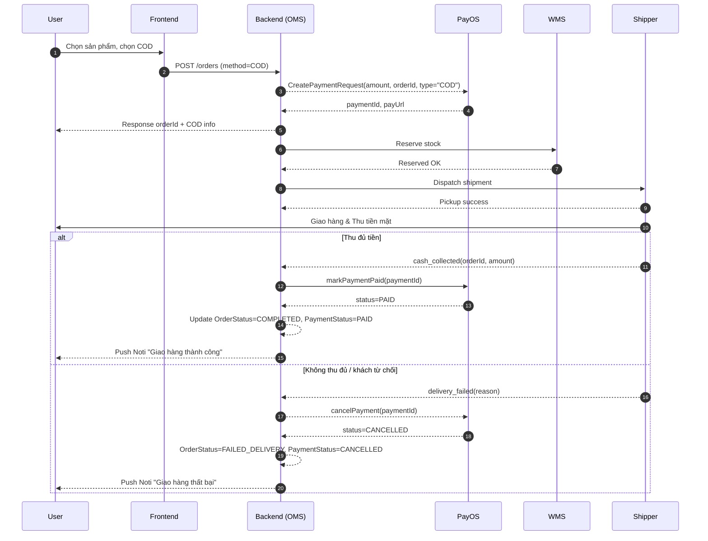

# Phân tích chuyên sâu luồng đặt hàng COD kết hợp PayOS

> **Tài liệu này mô tả chi tiết các kịch bản nghiệp vụ cho quy trình đặt hàng sử dụng **COD (Cash on Delivery)** nhưng xử lý trạng thái & thanh toán thông qua **PayOS** trong dự án **Summer2025SWD391_SE1703_Group1**. Nội dung được đối chiếu với quy trình thực tế của Shopee để đảm bảo tính thực tiễn và trải nghiệm người dùng tối ưu.

---

## 1. Bối cảnh & Mục tiêu

1. Người mua chọn phương thức **"Thanh toán khi nhận hàng (COD)"**. 
2. Hệ thống vẫn tạo **đơn yêu cầu thanh toán (Payment Request)** trên PayOS nhằm:
   - Theo dõi / đối soát đơn hàng.
   - Cho phép chuyển đổi sang thanh toán online (nếu người mua muốn trả trước).
   - Khóa tồn kho, giảm rủi ro boom hàng.
3. Tài liệu này phân tích tất cả trường hợp:
   - **Luồng thành công** (giao hàng & thu tiền đủ).
   - **Luồng thất bại** (huỷ giao, giao không thành công, không thu đủ tiền,…).
   - **Khách quên thanh toán online** (đơn ở trạng thái treo).

## 2. Thành phần tham gia (Actors & Entities)

| Actor / Entity | Vai trò |
|----------------|---------|
| User (Buyer)   | Đặt hàng, trả tiền khi nhận hoặc online qua PayOS |
| Merchant (Shop)| Xử lý đơn, giao hàng, thu COD |
| PayOS Gateway  | Khởi tạo Payment Request, nhận Webhook trạng thái |
| Shipper        | Vận chuyển & thu tiền mặt |
| Hệ thống OMS   | Order Management System (GreenWeave backend) |
| Hệ thống WMS   | Warehouse Management System – xuất kho |

**Các bảng dữ liệu chính:** `orders`, `payments`, `shipments`, `order_status_logs`, `payment_status_logs`.

## 3. Trạng thái (State Machines)

### 3.1 OrderStatus

```
PENDING → CONFIRMED → PACKED → SHIPPED → DELIVERED → COMPLETED
                 ↘ (return) ↘ (failed)
                  CANCELLED  FAILED_DELIVERY
```

### 3.2 PaymentStatus (PayOS)

```
UNPAID → AUTHORIZED → PAID
        ↘ EXPIRED
        ↘ CANCELLED
```

> Lưu ý: Với COD, `PaymentStatus` ban đầu = `UNPAID`. Khi shipper thu tiền mặt, hệ thống **ghi nhận** qua Webhook nội bộ (`cash_collected`) và cập nhật thành `PAID`.

## 4. Luồng chính – Thành công (Happy Path)



### Bảng so sánh với Shopee

| Bước Shopee | Tương ứng hệ thống | Khác biệt |
|-------------|--------------------|-----------|
| Đơn mới (`Chờ xác nhận`) | `PENDING` | Giống |
| Người bán xác nhận | `CONFIRMED` | Giống |
| Đang giao | `SHIPPED` | Giống |
| Đã giao thành công | `COMPLETED` | Shopee auto-set Khi đối soát COD, ta cần webhook `cash_collected` |

## 5. Luồng thất bại & các biến thể

### 5.1 Shipper giao không thành công (Khách hẹn lại / bom hàng)

* **Trigger:** Shipper báo `delivery_failed`.
* **Xử lý:**
  1. `OrderStatus` ➜ `FAILED_DELIVERY`.
  2. `PaymentStatus` ➜ `CANCELLED`.
  3. Ghi log & mở tùy chọn **re-attempt** giao lần 2.
* **Đối chiếu Shopee:** Shopee chuyển trạng thái `Trả hàng/Hoàn tiền`.

### 5.2 Hệ thống không tạo được Payment Request trên PayOS

* **Trigger:** API PayOS timeout / error.
* **Rollback:**
  1. Không tạo record `payments`.
  2. Trả lại kho (`stock_unreserve`).
  3. `OrderStatus` ➜ `CANCELLED` ngay lập tức.
  4. Thông báo lỗi đến User.

### 5.3 PayOS Webhook `EXPIRED`

* **Nguyên nhân:** Payment Request quá hạn (ví dụ >72h) mà chưa ghi nhận tiền mặt.
* **Hành động:**
  - `PaymentStatus` ➜ `EXPIRED`.
  - `OrderStatus` vẫn `SHIPPED` nếu đang giao; nếu chưa giao → `CANCELLED`.

## 6. Khách hàng quên thanh toán online (Chuyển đổi từ COD sang Online)

Nếu người mua bấm "Thanh toán ngay" trong app trước khi shipper giao:

1. **FE** mở `payUrl` PayOS.
2. Sau khi thanh toán thành công, PayOS Webhook ➜ `PAID`.
3. `OrderStatus` không đổi (`SHIPPED`/`PACKED`), chỉ `PaymentStatus` = `PAID`.
4. Khi shipper giao, chỉ ký nhận (không thu COD).

> **Rủi ro:** Shipper vẫn thu tiền mặt ➜ double collect. Cần tính năng **double-check**: Nếu `PaymentStatus=PAID` gửi alert cho shipper.

## 7. Bảng trạng thái & hành động cập nhật

| Event | OrderStatus | PaymentStatus | Tác vụ bổ sung |
|-------|-------------|--------------|----------------|
| Tạo đơn COD thành công | PENDING | UNPAID | – |
| Xác nhận đơn | CONFIRMED | UNPAID | Khóa kho |
| Thu tiền thành công | COMPLETED | PAID | Gửi email hóa đơn |
| Thu không thành công | FAILED_DELIVERY | CANCELLED | Mở yêu cầu giao lại / hủy |
| Webhook EXPIRED | CANCELLED | EXPIRED | Trả hàng về kho |
| Khách thanh toán online | (giữ nguyên) | PAID | Gửi thông báo tới shipper |

## 8. Rủi ro & Kiến nghị cải tiến

1. **Boom hàng**: Thêm tính năng đặt cọc (% nhỏ) → giảm tỷ lệ bom.
2. **Webhook độc lập PayOS**: Lưu log, retry 3 lần nếu timeout.
3. **Đối soát COD**: Cron job cuối ngày đối soát tiền thu & chênh lệch.
4. **Đa kênh thông báo**: App + SMS để giảm "quên thanh toán".
5. **Dashboard real-time** cho CSKH: Theo dõi `FAILED_DELIVERY` để gọi xác nhận lại.

## 9. Kết luận

Luồng COD kết hợp PayOS cho phép **linh hoạt** giữa thanh toán khi nhận và trả trước, đồng thời đảm bảo khả năng theo dõi và đối soát tự động. Việc mô phỏng theo Shopee giúp giảm rủi ro vận hành và mang lại trải nghiệm quen thuộc cho người dùng Việt Nam.

---

> **Phiên bản**: v1.0 – 2025-06-15
>
> **Người soạn**: BA Team (AI-generated) 