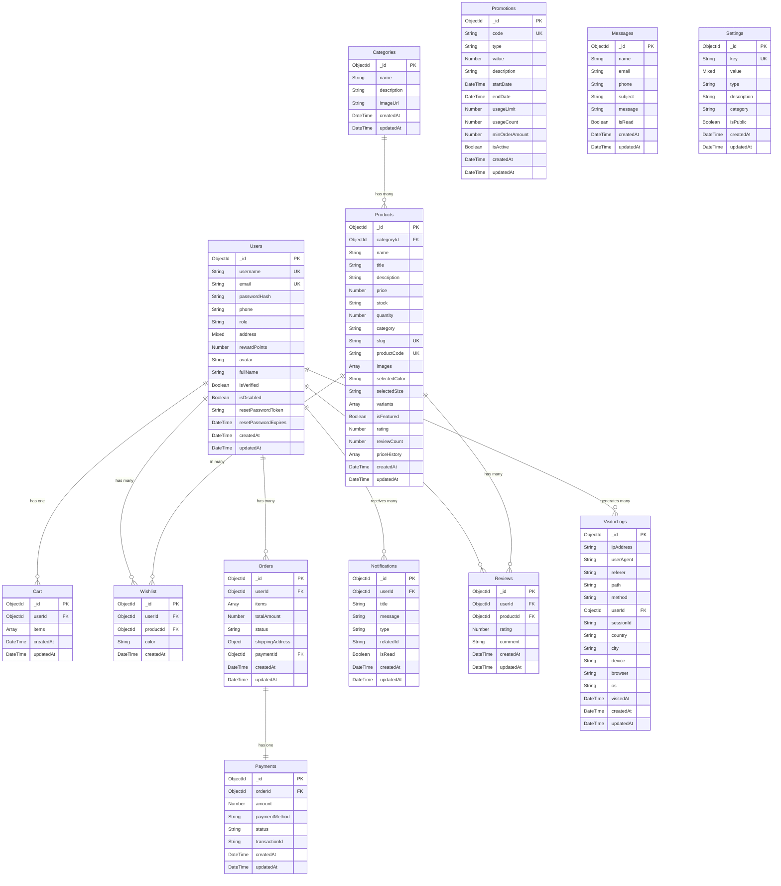

# Database ERD - GreenWeave Project

## Entity Relationship Diagram



## Embedded Documents Structure

### Products.variants
```javascript
{
  variantId: String,
  color: String,
  imageUrl: String,
  stock: Number
}
```

### Products.priceHistory
```javascript
{
  price: Number,
  updatedAt: DateTime
}
```

### Cart.items
```javascript
{
  _id: ObjectId,
  productId: ObjectId, // ref: Products._id
  variantId: String,
  color: String,
  quantity: Number
}
```

### Orders.items
```javascript
{
  _id: ObjectId,
  productId: ObjectId, // ref: Products._id
  quantity: Number,
  price: Number
}
```

### Orders.shippingAddress
```javascript
{
  street: String,
  city: String,
  state: String,
  zipCode: String,
  country: String
}
```

## Database Indexes

### Products
- Text search index: `name`, `title`, `description`
- Unique indexes: `slug`, `productCode`
- Regular index: `categoryId`

### Users
- Indexes: `username`, `email`

### Settings
- Indexes: `key`, `category`, `isPublic`

### VisitorLogs
- Indexes: `ipAddress`, `userId`, `visitedAt`, `path`, `country`

### Notifications
- Index: `userId`

### Wishlist
- Indexes: `userId`, `productId`

## Enum Values

### Users.role
- `"admin"` - Quản trị viên
- `"user"` - Người dùng thường
- `"staff"` - Nhân viên

### Products.stock
- `"Còn hàng"` - Có sẵn
- `"Hết hàng"` - Không có sẵn
- `"Sắp về"` - Sắp có hàng

### Orders.status
- `"pending"` - Đang chờ xử lý
- `"shipped"` - Đã gửi hàng
- `"delivered"` - Đã giao hàng
- `"cancelled"` - Đã hủy

### Payments.status
- `"pending"` - Đang chờ thanh toán
- `"completed"` - Đã thanh toán
- `"failed"` - Thanh toán thất bại
- `"cancelled"` - Đã hủy thanh toán

### Payments.paymentMethod
- `"stripe"` - Thanh toán qua Stripe
- `"paypal"` - Thanh toán qua PayPal
- `"cash"` - Thanh toán tiền mặt
- `"credit_card"` - Thẻ tín dụng

### Notifications.type
- `"order"` - Thông báo đơn hàng
- `"promotion"` - Thông báo khuyến mãi
- `"system"` - Thông báo hệ thống
- `"general"` - Thông báo chung

### Promotions.type
- `"percentage"` - Giảm theo phần trăm
- `"fixed"` - Giảm số tiền cố định

### Settings.type
- `"string"` - Chuỗi ký tự
- `"number"` - Số
- `"boolean"` - Boolean
- `"object"` - Object
- `"array"` - Mảng

### VisitorLogs.method
- `"GET"` - HTTP GET
- `"POST"` - HTTP POST
- `"PUT"` - HTTP PUT
- `"DELETE"` - HTTP DELETE
- `"PATCH"` - HTTP PATCH

## Notes

1. **Users.address**: Có thể là string, object hoặc array tùy theo ngữ cảnh sử dụng
2. **Products**: Có hỗ trợ tìm kiếm full-text trên các trường name, title, description
3. **VisitorLogs**: Dùng để tracking và analytics người dùng
4. **Settings**: Hệ thống cài đặt linh hoạt với khả năng public/private
5. **Promotions**: Hỗ trợ cả giảm giá theo phần trăm và số tiền cố định
6. **Notifications**: Hệ thống thông báo đa dạng với nhiều loại khác nhau

## Database Size Estimation

Dựa trên cấu trúc hiện tại, ước tính kích thước database:

- **Users**: ~1KB/record
- **Products**: ~2KB/record (bao gồm variants và images)
- **Orders**: ~1.5KB/record (bao gồm items)
- **Reviews**: ~0.5KB/record
- **VisitorLogs**: ~0.3KB/record
- **Other tables**: ~0.2-0.5KB/record

Với 10,000 users, 1,000 products, 50,000 orders: ~100MB database size. 